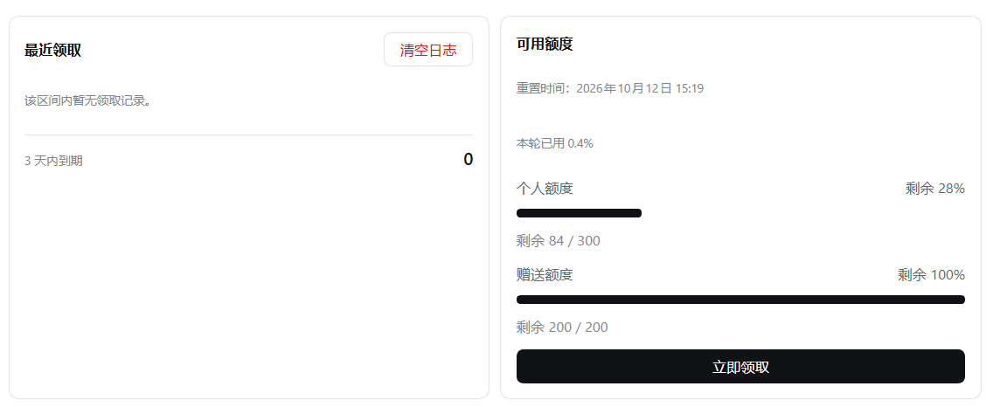
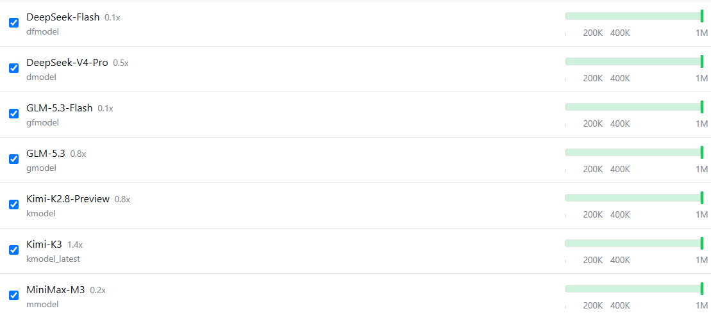
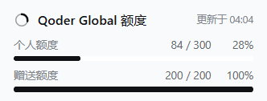
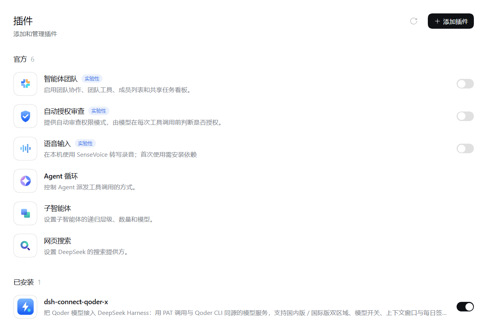
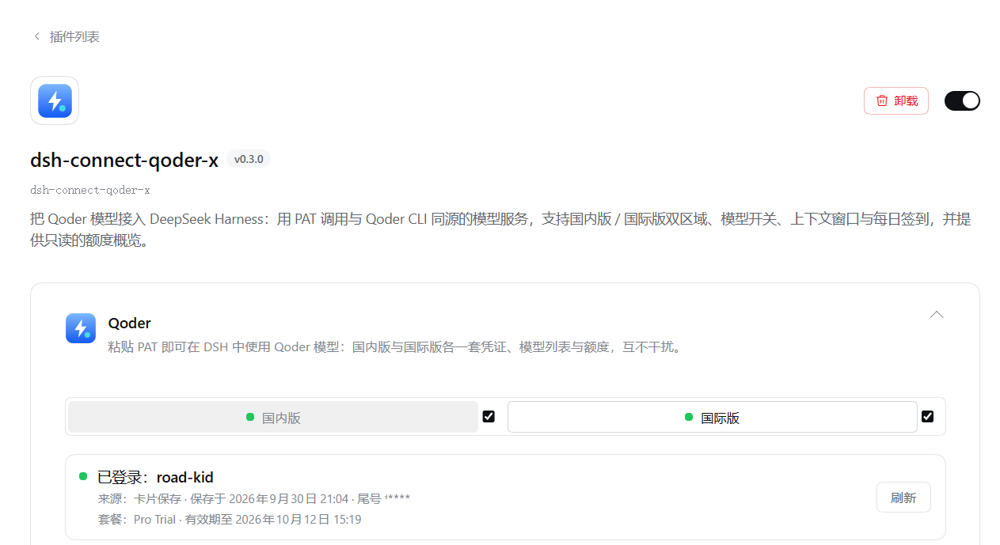

# dsh-connect-qoder-x

[English](./README.en.md) | **简体中文**

把 **Qoder 订阅**的模型以个人访问令牌（PAT）接入 [DeepSeek Harness](https://github.com/deepseek-ai/deepseek-harness)（DSH）的社区插件。

更新日志见 [CHANGELOG.md](./CHANGELOG.md)（英文）。

一个插件同时服务两条 Qoder 产品线，各自一套凭证、一个 provider、一份模型目录，互不混用：

| 变体 | provider id | PAT 生成站点 |
|---|---|---|
| 国内版 | `qoder` | qoder.com.cn |
| 国际版 | `qoder-global` | qoder.com |

只需要哪一版就只配哪一版：未保存 PAT 的变体不显示模型分组，另一版完全不受影响。流式输出、推理内容、工具调用走插件内置的 Qoder 传输层；对话循环、压缩与权限始终由 DSH 本体掌控。

---

## 这个仓库是什么

`dsh-connect-qoder-x` 是 [DeepSeek Harness](https://github.com/deepseek-ai/deepseek-harness)（DSH）的社区插件：用个人访问令牌（PAT）把 Qoder 的模型接入 DSH，国内版与国际版各自一套凭证、provider 与模型目录，互不混用。

**本插件的标识**（安装、排障、看数据目录时会用到）：

| 项 | 值 |
|---|---|
| 包名 | `dsh-connect-qoder-x` |
| profile 行 id | `llm-qoder-x` |
| 数据目录 | `<profile>/.dsh-connect-qoder-x/` |
| HTTP 路由前缀 | `/plugins/dsh-connect-qoder-x/*` |
| CLI 命令 | `dsh-connect-qoder-x` |

**为什么行 id 与包名不一致**：DSH 的插件配置槽 key 是 `` `${包名}#${行id}` ``，包名来自 `package.json`、行 id 来自插件 patch 声明的 `id`。两者都写全名，是为了让这个 key 在任何 profile 里都唯一、不与其它 Qoder 插件相撞。详见[设置界面与 DSH 版本](#设置界面与-dsh-版本)。

---

## 功能

- **PAT 即存即用**：在设置卡片上粘贴 PAT 点「保存」，插件先对该变体的区域实时校验，通过才落盘，模型分组立即出现，无需重启 DSH。已登录后可「更换 PAT」（新令牌校验通过才覆盖，粘贴打错不会把可用凭据弄丢）与「清除 PAT」。
- **双变体独立配置**：`qoder`（china）与 `qoder-global`（global）各有自己的凭证文件、路由与已保存目录——qoder.com 生成的令牌对中国区无效，反之亦然，两套永不互串。
- **模型目录三级降级（live → saved → fallback）**：卡片明示当前列表来自哪里——「模型列表更新于 …」（实时拉取）、「当前显示已保存的模型列表，更新于 …」（本账号上次成功目录，重启或断网后顶上来）、「当前显示内置模型列表（尚未从 Qoder 更新）」（编译进插件的兜底名单）；最近一次拉取失败时附带原因，并可在卡片上手动「刷新模型列表」。
- **上下文窗口一键切换**：变体卡片的「上下文窗口」页列出每个模型可用的窗口容量，并提供「使用 Qoder 声明的最大上下文窗口」开关（默认勾选）：勾选后，声明了更大窗口的模型按最大窗口发请求；不勾选则按目录给出的默认窗口。窗口值全部来自 Qoder 目录接口，未声明的行退回插件内置的保守默认值（180K）。两版开关状态独立保存、互不影响。
- **模型自由开关与批量管理**：变体卡片提供「模型开关」页，可自由开启或关闭指定模型；关闭的模型将自动从 DSH 的模型选择器中隐藏；顶部提供按名称/ID 的即时搜索框，并支持全选与一键「批量开启」/「批量关闭」。
- **每日签到（自动 + 手动）**：每天可领取 100 Credits。领取窗口是 **10:00 → 次日 10:00（UTC+8）**，不是自然日——插件全程按「窗口」判断本轮是否已领：夜里 23 点领完，凌晨打开卡片仍是「今日已签到」，到次日 10:00 才重新变为「立即领取」；自定义签到时刻会同步移动窗口边界。自动签到**默认关闭**，需在卡片上按变体单独开启（时刻默认 10:00），开启后开机自动补签防漏。「最近领取」面板列出**实际到手**的每个资源包及其到期日——只有真实领取才入账，重复点击不再制造幽灵记录。**国际版要求本机已安装 Qoder 桌面客户端**：国际服务只对携带客户端生成的设备风控身份的请求下发该活动，未安装时插件会明确提示「需要本机安装 Qoder 客户端」而不是误报「今日无活动」。国内版无此要求。
- **侧栏额度展示 + 额度明细**：可分别为两版开启侧栏底部的额度小卡（默认关，开启前需为该变体保存 PAT），共享一个刷新间隔（默认 5 分钟，最小 1 分钟）。点侧栏小卡在中间面板打开「Qoder 额度」明细：按资源包逐行给出「剩余 / 总量 + 进度条｜到期时间」，合计占比与本轮重置时间一并展示；再点同一张卡关闭，点另一张切换到对应版本。
- **倍率显示 `x<priceFactor>`**：模型名后直接拼 Qoder 报价的价格倍率（模型选择器里显示为 `某模型 · x0.79`，免费为 `x0.0`），来自目录接口的 `price_factor` 字段，仅作展示、不影响请求；Qoder 未报倍率的模型不显示后缀，不会凭空补一个数。整数倍率统一补一位小数（`x1.0`），非整数倍率按 Qoder 原值显示（`x0.79`、`x1.6`）。卡片内的模型列表把同一数字写成 `0.5x` 的形式，两处数值一致、只是排版方向不同。

---

## 界面速览

「自动签到」页把账号状态、签到结果与额度放在一起：左侧是**最近领取**台账（逐笔列出实际到手的资源包与到期日），右侧是**可用额度**（按资源包给出剩余/总量与进度条）和「立即领取」按钮。



「模型」页可逐个开关模型、批量启用/停用、按名称或 ID 搜索，并为每个模型选择上下文窗口。关闭的模型会从 DSH 的模型选择器中消失：



侧栏额度小卡（默认关闭，可在卡片里按变体开启），显示该账号的剩余额度与更新时间：



---

## 在哪里找到设置界面

DSH 0.1.7 起把插件配置统一收进**「插件」页**（0.2.x 沿用同一套槽位）。装好后它出现在「插件」页的**「已安装」**分组里：



点它进入包详情页，设置正文**直接内联**在包描述下方——这就是本插件的设置界面：



卡片本身不自绘折叠外壳（标题、图标、面包屑由「插件」页绘制），内部用「**自动签到** / **模型**」两个页签承载全部功能：「自动签到」页是账号、可用额度、领取台账与签到动作，「模型」页是模型开关与上下文窗口。

> **找不到设置入口时**：本插件的卡片只出现在「插件」页。若你在「设置」里翻找过，那里没有本插件的入口——插件配置自 DSH 0.1.7 起统一收归「插件」页。

---

## 安装

前置条件：

- DSH 核心 **`>=0.1.7-rc.1 <0.3.0`**（0.1.7 与 0.2.x 均可；区间以 `peerDependencies` 声明，这是 DSH 安装时**实际校验**的字段——`app-boot` 的兼容性预检只读 peer 依赖，不读 `engines.dsh`）；
- Node.js `^22.19.0 || >=24.0.0`（`package.json` engines）；
- 你自己的 Qoder 账号，以及至少一枚个人访问令牌。

> **DSH 版本支持范围**
>
> 本插件注册在 DSH 0.1.7 起的**插件配置槽位**上，因此**要求 DSH ≥ 0.1.7**：
> 在 **0.1.5 / 0.1.6** 上宿主功能（模型、PAT、目录、签到）照常可用，
> 但**设置卡片不会出现**（那两个版本没有 `plugins.row.config` 槽）。
>
> 上限为 `<0.3.0`：已核对 `dsh-v0.1.7-rc.2` → `dsh-v0.2.0-rc.1` 两个 tag，
> 本插件所依赖的全部 9 个包**零源文件变更**，故 0.2.x 无需改动即可运行。
> 区间写在 `peerDependencies`——DSH 安装时校验的就是这个字段。

```sh
# 从 GitHub 安装
dsh plugin --profile web add github:road-kid/dsh-connect-qoder-x
```

按你使用的 profile 换 `--profile` 的值（`web` / `desktop` / `tui`）。装到哪个 profile，数据就落在哪个 profile 目录里，各自独立。

> **与其它 Qoder 插件共存**：本插件的包名、行 id、路由前缀与数据目录都是独立命名，因此可以与其它 Qoder 插件同时安装、配置互不干扰。（同一个插件装两次则不行——profile 里同名的行只应存在一个。）

---

## 配置与使用

### 生成 PAT

- **Qoder（国内版）**：登录 qoder.com.cn → 账号设置 → 个人访问令牌，生成后复制。[直达获取](https://qoder.cn/account/integrations)
- **Qoder Global（国际版）**：登录 qoder.com → 账号设置 → 个人访问令牌，生成后复制。[直达获取](https://qoder.com/account/integrations)

### 在卡片上保存

按上一节的路径打开设置界面，把 PAT 粘贴进密码输入框，点「保存」（期间显示「校验并保存中…」）。保存动作会先经 Qoder 校验令牌对该变体的区域有效，失败则不落盘。**两类失败分别提示**：Qoder 明确拒绝 → 「PAT 无效或已过期 — 请到账号设置重新生成后再试。」；连不上 Qoder（超时/网络/5xx）→ 「无法连接 Qoder 校验该 PAT（…）。令牌未保存 — 请检查网络后重试。」——网络问题不会把可用令牌说成坏令牌。两版各填各的卡片即可两组并存。

### 环境变量兜底

不方便走卡片的场景可用环境变量：**未保存过凭证文件**时插件读取 env 兜底——

| 变体 | 环境变量 |
|---|---|
| `qoder`（china） | `QODER_CN_PERSONAL_ACCESS_TOKEN` |
| `qoder-global` | `QODER_PERSONAL_ACCESS_TOKEN` |

优先级为 **文件 > env**：只要该变体保存过有效的凭证文件，环境变量就不再生效。

---

## 数据与隐私

插件的全部自有文件收在数据目录一处：`<profile>/.dsh-connect-qoder-x/`（凭据在根，可重建的缓存在 `state/` 子目录）：

```text
<profile>/.dsh-connect-qoder-x/
├── .qoder-auth.json              # 中国版 PAT（{version:2, pat, region, savedAt}）
├── .qoder-global-auth.json       # 国际版 PAT
├── settings.json                 # 侧栏展示 / 签到时刻等自有配置
├── checkin-status.json           # 签到状态与领取台账
└── state/
    ├── .qoder-catalog.json       # 中国版按账号保存的模型目录
    ├── .qoder-global-catalog.json
    ├── .qoder-probe.json         # 中国版推理档位探测记录
    ├── .qoder-global-probe.json
    ├── .qoder-host-heartbeat.json
    └── .qoder-machine-id
```

环境变量 `DSH_QODER_DATA_DIR` 可显式覆盖数据目录。

**国际版签到的设备身份**：Qoder 国际服务只对携带「设备风控身份」的请求下发每日活动，
该身份无法伪造，只能由本机安装的 Qoder 桌面客户端自带的签名组件（`runtime-info`）
现场生成——它指纹的是**这台机器的真实硬件/虚拟化状态**。返回的三个风控头
（`Cosy-MachineToken/Code/Type`）**只随签到相关的两个请求（活动列表、领取）发出**，
不写盘、不缓存，每次签到现取现用。未装客户端时插件如实报告「需要本机安装
Qoder 客户端」并跳过国际签到（国内版不受影响）。另注意：模型目录/对话/图片请求
携带的是插件自己的稳定机器码（`.qoder-machine-id`，一个持久化的随机 UUID），
与上面签到用的风控身份是两回事，互不派生。

---

## 设置界面与 DSH 版本

DSH 0.1.7 起，插件配置改由 `ui-plugin-manager` 的**键控槽**承载：`settings.section` 下不再有第三方可用的插件设置子槽，「内置插件」页也改建为只认 `settings.plugins.tab` 的 tab 容器，旧的 `settings.plugin.item` 已从 `SlotMap` 移除。本插件据此注册两个槽：

| 槽 | key | 作用 |
|---|---|---|
| `plugins.row.config` | `dsh-connect-qoder-x#llm-qoder-x` | 行列表出现「配置」按钮，点开是本卡片 |
| `plugins.bundle.config` | `dsh-connect-qoder-x` | 包详情页内联渲染同一张卡片 |

行 key 是 `` `${包名}#${行id}` ``：包名来自 `package.json`，行 id 来自本插件 patch 声明的 `id`。**两者都写全名，正是为了让这个 key 在任何 profile 里唯一**，不与其它 Qoder 插件相撞。

卡片组件遵循宿主的 `view` 契约：

- `view === 'summary'` → 只返回一行简介（卡片列表的副标题）
- `view === 'page'` → 返回设置正文，**不自绘标题与折叠外壳**（宿主已经画了）

---

## 开发

```sh
pnpm install
pnpm run build      # tsdown 产出 lib/（宿主 bundle + client bundle）
pnpm test           # vitest run
pnpm run test:qoder # node --test（Qoder 传输层用例）
pnpm run typecheck  # tsc：宿主 + client 两份 tsconfig
pnpm run check      # typecheck + test + test:qoder + build
```

> **已知失败用例**：全量共 **469** 条用例，每轮 **462~463 passed / 6~7 failed**。失败集中在 3 个文件：`tests/adapter.spec.ts` 1 条（代码与测试期望本身不一致）、`tests/catalog-lifecycle.spec.ts` 1 条（模块级状态在用例间泄漏）、`tests/reasoning-merge.spec.ts` 5 条（`boot()` 后 5 秒超时的偶发失败，各轮在 4~5 条间波动，故 passed 数在 462/463 之间摆动）。这 3 个文件属于既有基线失败，非本版本引入。另：`test:qoder`（node --test 的 Qoder 传输层用例）**131/131** 全绿。

---

## 致谢

本项目的实现参考了以下开源项目，在此致谢：

- [dsh-qoder-connect](https://github.com/masknull/dsh-qoder-connect) — 插件骨架与 connect 机制
- [dsh-workbuddy-connect](https://github.com/masknull/dsh-workbuddy-connect) — 设置卡片与侧栏交互的形态
- [dsh-provider-qoder](https://github.com/mo-n/dsh-provider-qoder) — Qoder 传输层协议细节

以上项目均以 MIT 许可发布；本项目同样按 [MIT](./LICENSE) 发布。本项目与 Qoder、DeepSeek 官方均无关联，是社区适配器——非官方实现。

## 免责声明

- Qoder 的接口由其服务端提供、可能随时变动：Qoder 可能改动、限流或封禁调用方，导致本插件部分或全部功能失效，不保证兼容窗口。
- 本工具仅供个人学习研究，用于驱动**使用者自己的** Qoder 账号；请勿用于商业转售或任何超出个人合理使用的场景。使用即表示你自行承担账号被限制、额度损失、服务中断等一切后果，并遵守 Qoder 的服务条款。
- 作者不对因使用或滥用本插件产生的任何直接或间接损失负责。文中出现的 Qoder、DeepSeek 等名称与商标归各自权利人所有，仅作兼容性描述之用。
